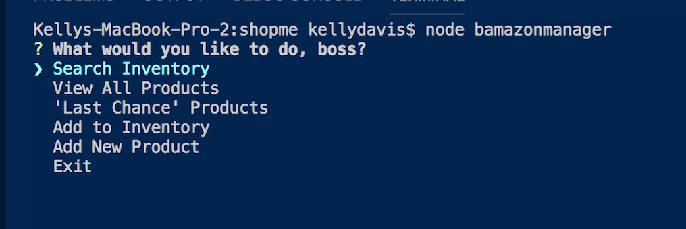
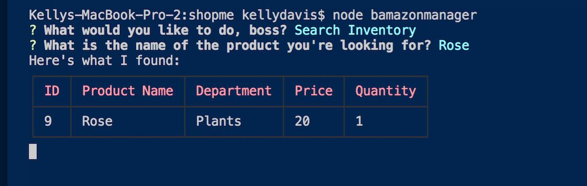

# shopme
A command line interface for an example store.

<h1>Technologies Used</h1>
<ul>
<li>Javascript</li>
<li>Node.js</li>
<li>MySQL</li>
<li> 
<a href="https://www.npmjs.com/package/cli-table">CLI Table</a>
</li>

<!-- <h2>Set up</h2> -->
# Installation
Use the backage manager [npm](https://www.npmjs.com/) to install npm package.

```bash
npm install
```


<!-- how to use -->
<h2>Features</h2>

